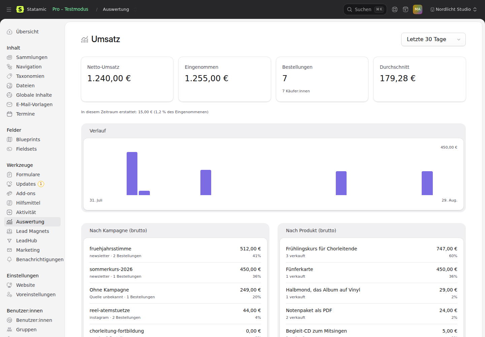

# Statamic Insights

Reporting for the Statamic addon family. Any addon can contribute a number;
this one turns it into a screen.

> Its single question: what does the data you already have actually say?

Two screens today. **Revenue** is the curated one — the report you open with a
question in mind. **Metrics** lists everything anybody registered, so a figure
contributed tomorrow appears without a line of this addon changing.

## Requirements

| | |
|---|---|
| PHP | 8.2+ |
| Statamic | 6.0+ |
| Data source | [`goldnead/statamic-payments`](https://github.com/goldnead/statamic-payments) — without it the screen says so and shows nothing |
| Optional | `goldnead/statamic-leadhub` — lifetime revenue per contact |

## Installation

```bash
composer require goldnead/statamic-insights
```

That is the whole of it. The screen appears under **Tools → Insights**, gated by
a `view insights` permission that is registered with the addon.

Configuration is optional:

```bash
php please vendor:publish --tag=statamic-insights-config
```

```dotenv
STATAMIC_INSIGHTS_CURRENCY=EUR   # which currency the screen opens on
STATAMIC_INSIGHTS_PERIOD=30d     # 7d · 30d · 90d · 12m · ytd · all
```

## Usage

Open **Tools → Insights**. The screen answers four questions at a glance and two
in detail:

| | |
|---|---|
| **Net revenue** | What was paid, minus what went back, in the chosen period |
| **Paid** | What came in, before refunds |
| **Orders** | How many, and how many distinct buyers behind them |
| **Average order** | Paid divided by orders |

Each carries the same figure for the period immediately before it, because a
revenue number on its own says nothing.

Below that: **Over time**, one bar per day (or per month over a long range);
**By campaign**, which is the question this addon exists for; and **By product**,
split across line items so an order bump is credited to itself.

The period and currency live in the query string — `?period=90d&currency=CHF` —
so a view can be shared or bookmarked.

## Contributing a metric

**This is the point of the addon.** Insights owns time ranges, comparisons,
charts and screens; it owns no data. Every figure it shows was contributed by
the addon that knows how to count it.

```php
use Goldnead\StatamicInsights\Contracts\Metric;
use Goldnead\StatamicInsights\Support\{MetricQuery, Unit};

class ActiveMembers implements Metric
{
    public function handle(): string { return 'memberships.active'; }
    public function label(): string  { return __('Active members'); }
    public function group(): string  { return __('Memberships'); }
    public function unit(): string   { return Unit::COUNT; }
    public function description(): ?string { return null; }
    public function available(): bool { return Schema::hasTable('memberships'); }

    public function value(MetricQuery $query): int|float|null { /* one number */ }
    public function series(MetricQuery $query): array { /* ['2026-08-01' => 12, …] */ }
    public function meta(MetricQuery $query): array { return []; }
}
```

Register it from your own service provider, inside `booted()`:

```php
$this->app->booted(function () {
    if (! class_exists('\Goldnead\StatamicInsights\Facades\Insights')) {
        return;
    }

    \Goldnead\StatamicInsights\Facades\Insights::registerMetric(ActiveMembers::class, 'memberships.active');
});
```

`booted()` and not `boot()`: this addon's bindings only exist once its own
provider has booted, and a sibling that registers earlier registers into
nothing. Put Insights in your `suggest`, never in `require` — the `class_exists`
guard means your metric classes are never loaded when it is absent.

The metric then appears on **every screen this addon has, present and future**,
with the period, the comparison against the period before, the chart and the
formatting done for it.

### If your numbers live in a table

`TableMetric` does the part every table-backed metric would write again:
windowing a period, bucketing a timestamp in three SQL dialects, splitting by a
column without dropping the rows whose value is null.

```php
class NewMembers extends TableMetric
{
    protected function table(): string     { return 'memberships'; }
    protected function timestamp(): string { return 'started_at'; }

    public function handle(): string { return 'memberships.started'; }
    public function label(): string  { return __('New memberships'); }
    public function group(): string  { return __('Memberships'); }
    public function unit(): string   { return Unit::COUNT; }

    public function value(MetricQuery $q): int|float|null
    {
        return $this->inPeriod($q)->count();
    }

    public function series(MetricQuery $q): array
    {
        return $this->bucketed($this->inPeriod($q), $q, 'count(*)');
    }
}
```

Override `inPeriod()` to add the conditions that make a row count at all — a
status, a brand, a soft delete. Put them there and they apply to the figure, the
chart and every split at once, where they cannot be forgotten in one of them.

Optional, not required. A metric whose numbers come from a file store, an API or
a calculation implements `Metric` directly and ignores this.

**Pick the timestamp deliberately.** There is no default, on purpose: the row is
written when the software noticed, and the fact happened when it happened. A
payment paid on the 30th and recorded on the 1st belongs to the 30th.

### Two optional extras

```php
interface HasBreakdowns    // 'split this by campaign, by product, …'
interface HasFilterOptions // 'these are the currencies you may filter me by'
```

Separate interfaces rather than methods on `Metric`, because most numbers are
just a number: a contract that demanded a breakdown from everybody would be
answered with empty arrays, and an empty array reads as "no data" rather than
"not applicable".

### Four rules the contract relies on

- **Null is not zero.** Return `null` where the question does not apply — a
  refund rate in a period that took nothing in has no answer, and `0 %` printed
  beside a refund amount is a statement its own neighbour contradicts.
- **`available()` decides existence, not the value.** A metric whose table is
  missing must say so there, not return zero. "Nothing to measure" and
  "measured nothing" are different statements.
- **Do not fill your own gaps.** `series()` returns only the buckets you have;
  Insights fills the rest. A metric that filled them itself is the one place a
  future implementer forgets.
- **Ignore filters you do not understand.** A screen passes a currency to every
  metric on it; one counting bookings has to shrug rather than fail.

### Where your numbers come from is your business

Reading an event ledger is the cheapest and the default. Reading your own
operational tables directly is a decision you may take for your own data —
and money is the case where you should: an event stream can drop or double a
row, and a revenue figure has to agree with a bank statement rather than with
a log. That is why `statamic-payments` reads its own tables and this addon
reads none.

## What the numbers mean

Three decisions shape every figure, and they are stated here rather than left
to be discovered:

**Sales count on the day they were paid. Refunds count on the day they went
back.** A refund in March of a January sale belongs to March, because that is
when the money left. It means a period can show a refund against a sale it never
contained — which is the cash view a person actually asks for, and it is said on
the screen instead of hidden.

**One currency at a time.** Adding 100 EUR to 100 CHF produces a number with no
meaning. The report filters to one currency and names the others it left out.

**Missing is missing.** A payment with no campaign is grouped under *no
campaign*, never dropped. A report that quietly excludes rows is the hardest
kind of wrong to notice: the total and the table disagree and nothing says why.

## Where the campaign comes from

`statamic-payments` freezes `utm_source`, `utm_medium`, `utm_campaign`,
`utm_term`, `utm_content`, `referrer` and `landing_page` on the payment at the
checkout. The host hands them in — see that addon's README. A payment taken
before those columns existed reports under *no campaign*, which is the honest
answer rather than a guess.

## On the contact screen

With `goldnead/statamic-leadhub` installed, every contact who has paid gets a
**Revenue** panel on their own screen: lifetime revenue, how many purchases,
what went back, and the first and last one.

The numbers are the CRM's — it keeps the ledger. This addon asks for them and
arranges them; nothing here computes money. The panel is contributed through
LeadHub's own registry rather than read from its side, because the CRM requires
nobody and one panel must not change that. A contact who has never paid gets no
panel at all: an empty card on every screen is noise that hides the ones with
numbers.

## Permissions

| Permission | What it opens |
|---|---|
| `view insights` | The revenue screen and its navigation entry |

## Development

```bash
composer install     # must run first: @statamic/cms is a file: dependency
npm install
npm run build        # writes resources/dist/build, which is committed
composer test
```

## Screenshots



More in `screenshots/`, captioned in `MARKETPLACE.md`.

## Further reading

- [`docs/reading-the-numbers.md`](docs/reading-the-numbers.md) — which question each
  figure answers, and the three that are answered differently than you might expect.

## Licence

Proprietary. See `LICENSE.md`.
